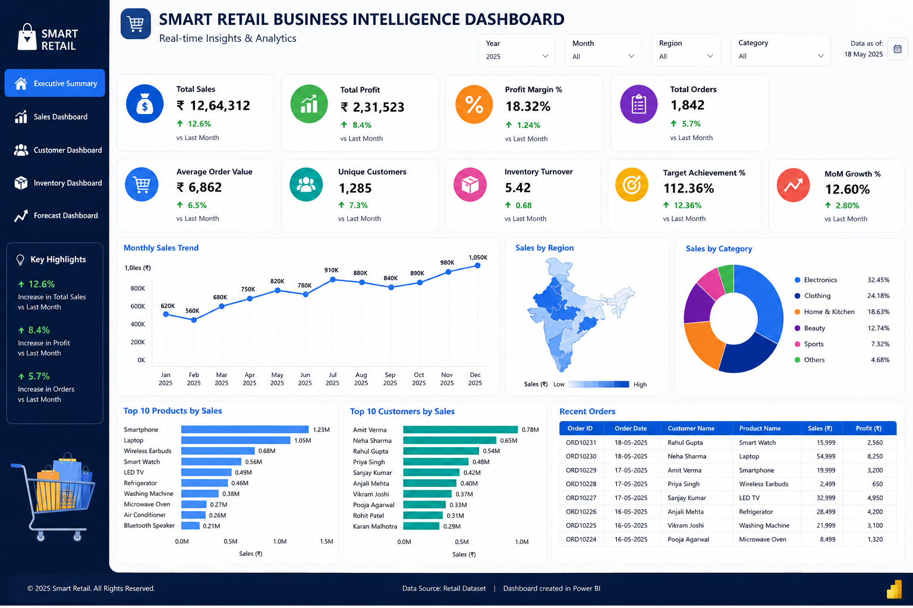
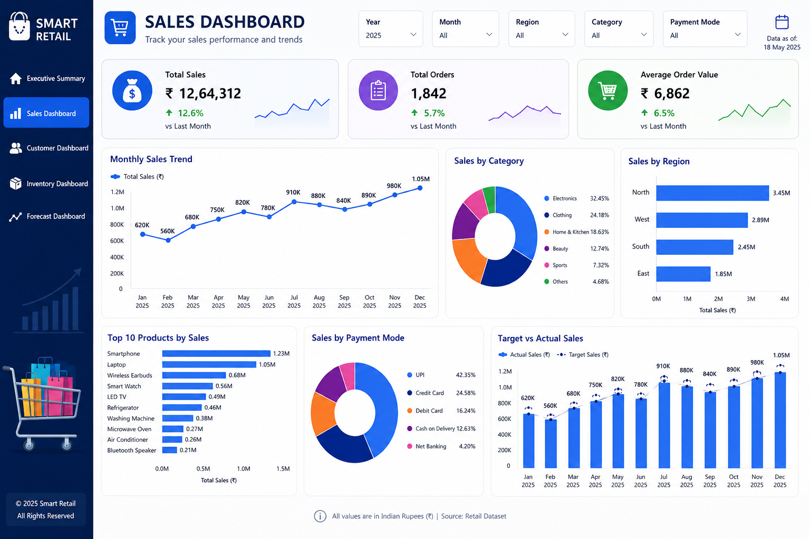
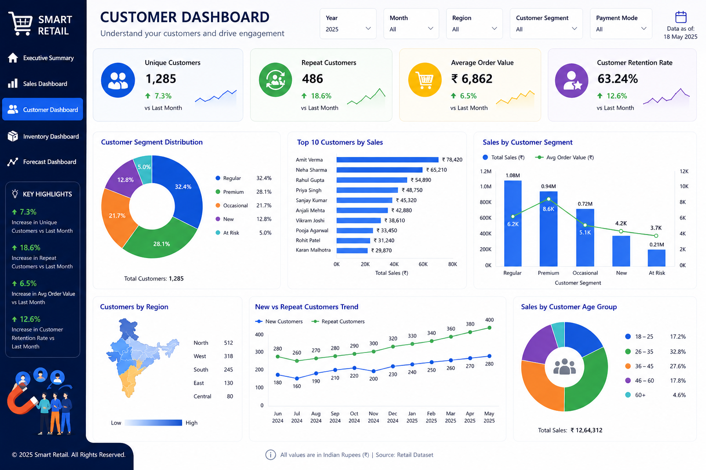
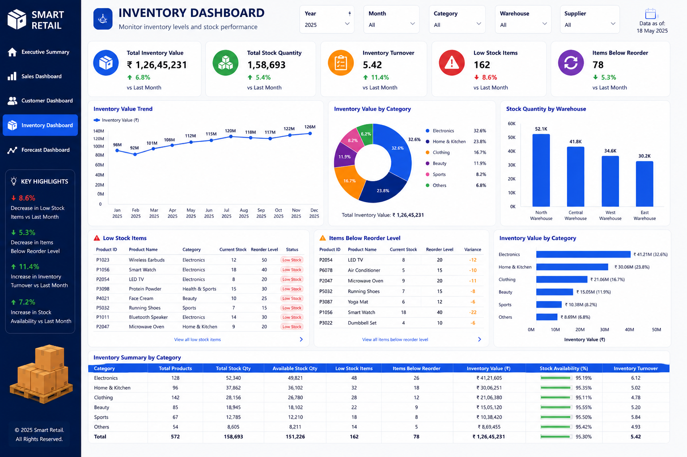
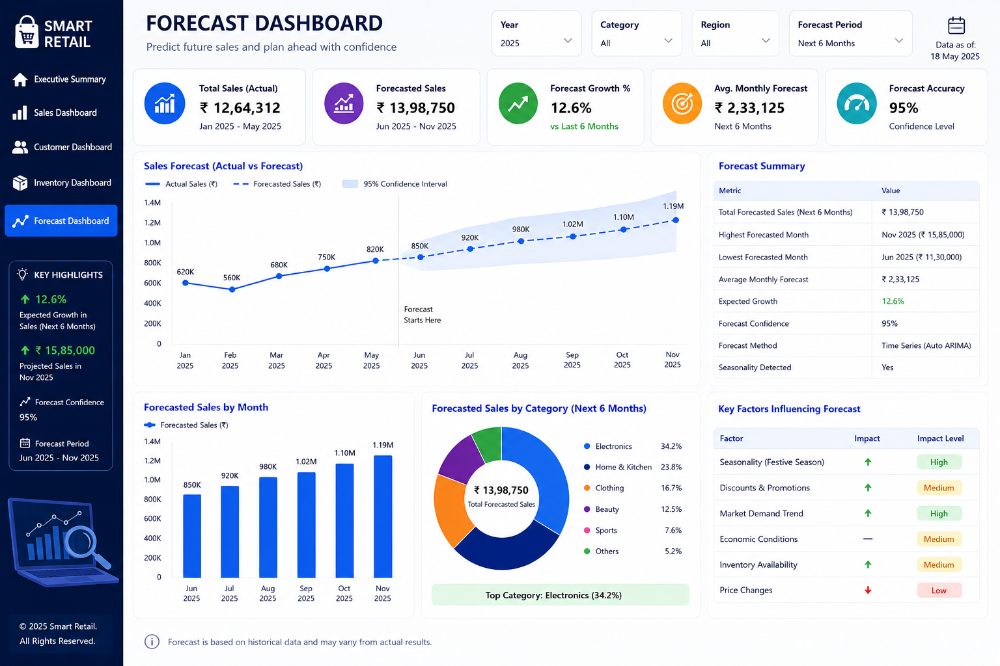

# 🛒 Smart Retail Business Intelligence Dashboard

[](https://app.fabric.microsoft.com/links/yDG885hetE?ctid=b637c4f6-57b7-44dc-bce4-fec0cd202460&pbi_source=linkShare)
[](https://app.fabric.microsoft.com/links/yDG885hetE?ctid=b637c4f6-57b7-44dc-bce4-fec0cd202460&pbi_source=linkShare)


A comprehensive **Power BI Business Intelligence solution** designed to transform retail data into actionable insights. This project helps businesses analyze sales performance, customer behavior, inventory management, and future trends through interactive dashboards and KPI-driven reporting.

---

# 🌐 Live Dashboard

### 🚀 Published Power BI Report

🔗 **View Dashboard:**

https://app.fabric.microsoft.com/links/yDG885hetE?ctid=b637c4f6-57b7-44dc-bce4-fec0cd202460&pbi_source=linkShare

The dashboard is published through Microsoft Fabric / Power BI Service and provides fully interactive analytics for retail business operations.

---

# 📌 Project Overview

The Smart Retail Dashboard provides a centralized analytics platform for monitoring and analyzing retail business performance.

The solution integrates:

* Executive Analytics
* Sales Analytics
* Customer Analytics
* Inventory Analytics
* Sales Forecasting

into a single interactive reporting environment that supports data-driven decision-making.

---

# 🎯 Business Objectives

* Monitor overall business performance.
* Analyze revenue and profitability trends.
* Understand customer demographics and purchasing behavior.
* Improve inventory management.
* Forecast future sales performance.
* Support strategic business decisions.

---

# 📊 Dashboard Modules

## 🏢 Executive Summary Dashboard

Provides a high-level overview of business performance and key metrics.

### Key KPIs

* 💰 Total Sales
* 💵 Total Profit
* 🛒 Total Orders
* 👥 Total Customers
* 📈 Profit Margin
* 🎯 Sales Target Achievement

### Insights

* Business Performance Overview
* Revenue Growth Analysis
* Profitability Monitoring
* Regional Performance Comparison
* Category Performance Tracking

---

## 📈 Sales Analytics Dashboard

Provides detailed insights into sales and revenue performance.

### Key KPIs

* Total Revenue
* Total Orders
* Average Order Value
* Profit Margin
* Sales Growth %

### Visualizations

* Monthly Sales Trend
* Sales by Category
* Sales by Product
* Sales by Region
* Top-Selling Products
* Revenue Contribution Analysis
* Profit Analysis

### Business Insights

* Identify top-performing products.
* Analyze regional sales performance.
* Monitor revenue growth trends.
* Evaluate profitability across categories.
* Support sales strategy planning.

---

## 👥 Customer Analytics Dashboard

Provides insights into customer demographics and purchasing behavior.

### Key KPIs

* Total Customers
* Active Customers
* Repeat Customers
* Average Customer Spend
* Customer Retention Rate

### Visualizations

* Customer Distribution by Region
* Customer Distribution by Gender
* Age Group Analysis
* Customer Purchase Frequency
* Top Customers by Revenue
* Customer Segmentation Analysis
* Monthly Customer Growth Trend

### Business Insights

* Identify high-value customers.
* Understand customer demographics.
* Analyze purchasing patterns.
* Improve customer retention.
* Support targeted marketing campaigns.

---

## 📦 Inventory Analytics Dashboard

Provides detailed inventory monitoring and stock analysis.

### Key KPIs

* Inventory Value
* Available Stock
* Low Stock Products
* Inventory Turnover
* Product Availability

### Visualizations

* Inventory Value by Category
* Stock Availability Analysis
* Inventory Trend Analysis
* Product-Level Monitoring
* Category-wise Inventory Distribution

### Business Insights

* Prevent stock shortages.
* Optimize stock levels.
* Improve inventory planning.
* Reduce inventory holding costs.

---

## 🔮 Sales Forecast Dashboard

Uses historical sales data to forecast future business performance.

### Key KPIs

* Predicted Sales
* Forecast Revenue
* Growth Forecast
* Forecast Accuracy

### Visualizations

* Monthly Sales Forecast
* Revenue Forecast Trend
* Seasonal Demand Analysis
* Growth Projection

### Business Insights

* Predict future demand.
* Support inventory planning.
* Enable proactive decision-making.
* Improve business forecasting.

---

# 🛠️ Tools & Technologies

| Technology         | Purpose                 |
| ------------------ | ----------------------- |
| Power BI           | Dashboard Development   |
| DAX                | KPI Calculations        |
| Power Query        | Data Transformation     |
| Excel              | Data Source             |
| Data Modeling      | Relationship Management |
| Data Visualization | Reporting & Analytics   |

---

# 🚀 Key Features

✅ Interactive Dashboards

✅ Dynamic KPI Cards

✅ Advanced DAX Measures

✅ Business Performance Tracking

✅ Forecasting Analytics

✅ Customer Segmentation

✅ Inventory Monitoring

✅ Drill-Through Reporting

✅ Interactive Filters & Slicers

---

# 🎨 Dashboard Assets & Icons

The project uses custom icons for KPIs, navigation, and visual storytelling.

| Asset                    | Purpose                 |
| ------------------------ | ----------------------- |
| available.png            | Product Availability    |
| business-and-finance.png | Executive Dashboard     |
| carts.png                | Shopping Cart Analytics |
| checklist.png            | Completed Orders        |
| delivery.png             | Delivery Analytics      |
| diagram.png              | Forecast Dashboard      |
| group.png                | Customer Analytics      |
| home.png                 | Dashboard Navigation    |
| increase.png             | Growth Metrics          |
| in-stock.png             | Inventory Status        |
| rupee.png                | Revenue & Profit        |
| rupee (1).png            | Financial Metrics       |
| sales.png                | Sales Analytics         |
| shopping.png             | Retail Overview         |
| shopping-bag.png         | Products Sold           |
| shopping-cart.png        | Orders Analysis         |
| target.png               | Sales Targets           |

---

# 📂 Repository Structure

```text
Smart-Retail/
│
├── Assets/
│   ├── available.png
│   ├── business-and-finance.png
│   ├── carts.png
│   ├── checklist.png
│   ├── delivery.png
│   ├── diagram.png
│   ├── group.png
│   ├── home.png
│   ├── increase.png
│   ├── in-stock.png
│   ├── rupee.png
│   ├── rupee (1).png
│   ├── sales.png
│   ├── shopping.png
│   ├── shopping-bag.png
│   ├── shopping-cart.png
│   └── target.png
│
├── Images/
│   ├── Executive_Dashboard.png
│   ├── Sales_Dashboard.png
│   ├── Customer_Dashboard.png
│   ├── Inventory_Dashboard.png
│   └── Forecast_Dashboard.png
│
├── Smart_Retail.pbix
│
└── README.md
```

---

# 📸 Dashboard Screenshots

## 🏢 Executive Summary Dashboard



---

## 📈 Sales Analytics Dashboard



---

## 👥 Customer Analytics Dashboard



---

## 📦 Inventory Analytics Dashboard



---

## 🔮 Sales Forecast Dashboard



---

# 📈 Business Impact

This dashboard enables businesses to:

* Improve operational efficiency.
* Track performance using KPIs.
* Understand customer behavior.
* Optimize inventory management.
* Forecast future demand.
* Support data-driven decision-making.

---

# 🧠 Skills Demonstrated

* Power BI Development
* Data Analytics
* Business Intelligence
* Data Visualization
* DAX Calculations
* Power Query
* Data Modeling
* Dashboard Design
* KPI Development
* Retail Analytics
* Forecasting
* Data Storytelling

---

# 🔗 Project Links

### 📂 GitHub Repository

https://github.com/anjithkumar-3ab/Smart-Retail

### 🌐 Published Power BI Dashboard

https://app.fabric.microsoft.com/links/yDG885hetE?ctid=b637c4f6-57b7-44dc-bce4-fec0cd202460&pbi_source=linkShare

---

# 👨‍💻 Author

## Anjith Kumar Bathala

**B.Tech – Computer Science & Engineering (AI & ML)**

💼 Data Analytics | Power BI | SQL | Python

🔗 LinkedIn: https://www.linkedin.com/in/anjith-kumar-bathala

🐙 GitHub: https://github.com/anjithkumar-3ab

---

# ⭐ Support

If you found this project useful, consider giving the repository a **Star ⭐**.

Feedback, suggestions, and contributions are always welcome.
